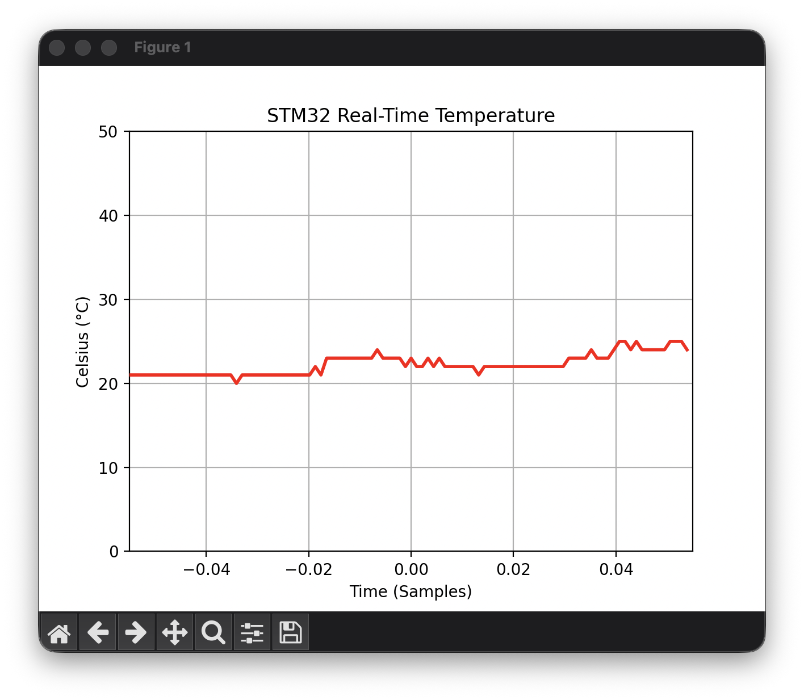
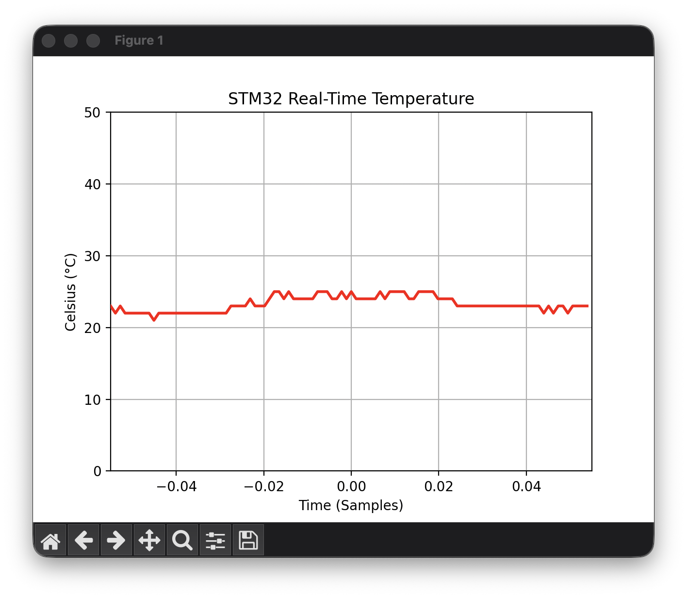

# 🌡️ STM32 Assembly Temperature Monitor

A bare-metal embedded system that reads temperature data using **pure Assembly Language** and visualizes it in real-time using Python.

 
 

## 🚀 Project Overview
This project demonstrates low-level embedded engineering capabilities by implementing a complete Data Acquisition System without using any C/C++ HAL (Hardware Abstraction Libraries). 

The system reads an analog temperature sensor, processes the data via DMA, and transmits it via UART to a host computer where a Python script plots the data live.

## 🧠 Key Features
* **Bare-Metal Assembly:** 100% of the firmware is written in ARM Cortex-M4 Assembly.
* **DMA (Direct Memory Access):** uses DMA to transfer ADC data to memory and Memory to UART without CPU intervention.
* **Race Condition Handling:** Implements semaphore-based synchronization to prevent data corruption between ADC updates and UART transmission.
* **Real-Time Visualization:** Custom Python script (`plot_temp.py`) using `matplotlib` and `pyserial` to plot temperature data at 20Hz.
* **Hardware Timer Trigger:** Uses TIM2 to trigger ADC conversions at precise intervals (100Hz).

## 🛠️ Hardware & Software
* **Microcontroller:** STM32F446RE (Nucleo-64 Board)
* **Sensor:** Internal Temperature Sensor
* **Language:** ARM Assembly
* **Host Software:** Python 3.9+ (Matplotlib, PySerial)
* **IDE:** STM32CubeIDE

## 🔌 Pin Connections
| Component | Nucleo Pin | Description |
|-----------|------------|-------------|
| TX Line   | PA2        | UART Transmit (USB VCP) |
| RX Line   | PA3        | UART Receive |
| Sensor    | Internal   | Connected to ADC1 Channel 0 |

## ⚙️ How to Run
### 1. Flash the Firmware
1.  Open the project in **STM32CubeIDE**.
2.  Build the project (Hammer icon).
3.  Connect the Nucleo board and hit **Run/Debug**.

### 2. Run the Python Plotter
Ensure you have Python installed, then set up the environment:

# Install dependencies
pip install -r requirements.txt

# Run the plotter

## 📂 Project Structure

TEMPERATURE_DATA_ACQUISITION_ASSEMBLY/
├── Src/
│   ├── main.s       # Main Loop & Race Condition Logic
│   ├── DMA.s        # Direct Memory Access Configuration
│   ├── ADC.s        # Analog Sensor Setup
│   ├── Tim2.s       # 100Hz Hardware Timer
│   ├── lab_uart.s   # Serial Driver (Tx/Rx)
│   └── Itoa.s       # Integer to ASCII Conversion
├── plot_temp.py     # Python Real-Time Grapher
├── requirements.txt # Python Library List
├── graph.png        # Screenshot of the plot
└── README.md        # This file

## 🐛 Challenges Solved
* **Race Condition (Data Corruption):** Initially, the system outputted glitchy values (e.g., "1121" instead of "23") because the CPU was updating the buffer while the UART DMA was still reading it. 
    * *Solution:* Implemented a "Busy Flag" check (Semaphore) to force the CPU to wait until the previous UART transmission is complete before touching the buffer.
* **DMA Bus Faults:** Encountered hard faults when writing to DMA control registers.
    * *Solution:* Implemented a "Wait for Disable" subroutine to ensure the DMA stream is fully disabled and the hardware is ready before attempting reconfiguration.
* **IDE & Console Crashes:** The UART was initially transmitting data too rapidly, overflowing the buffer and crashing the IDE.
    * *Solution:* Optimized the main loop timing and added appropriate delays to stabilize the data stream.
* **Cross-Platform Visualization:**
    * *Solution:* Created a robust Python script that auto-detects the specific STM32 USB port on macOS/Linux and handles real-time plotting via a Virtual Environment.

## 📜 License
This project is licensed under the MIT License - see the [LICENSE](LICENSE) file for details.
python plot_temp.py

